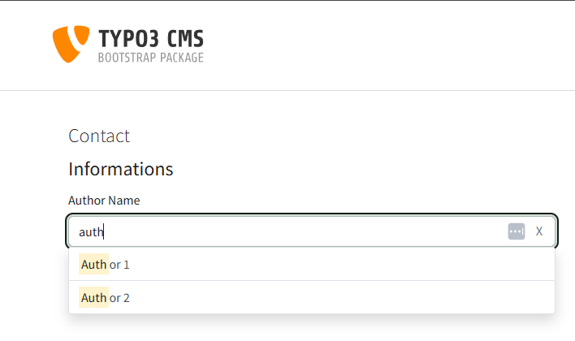
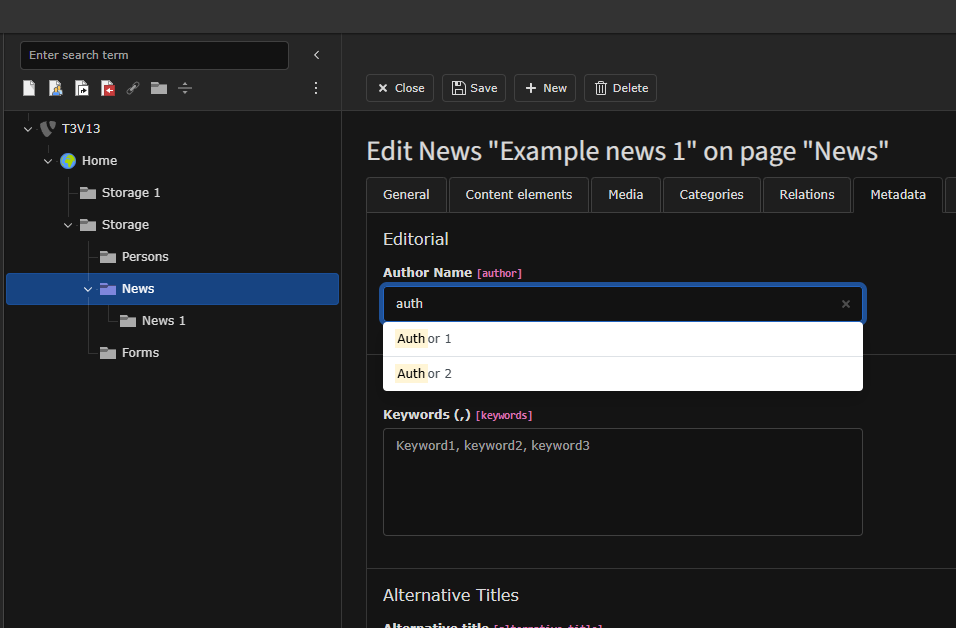

# Auto Suggest Extension

Adds a dynamic suggestion list below a text input field.
This extension includes jQuery to function properly.

---

#### Troubleshooting

```php
[FE][pageNotFoundOnCHashError] = 0
```

---

### Frontend



The auto suggest plugin works on the frontend using HTML data attributes.

    {namespace as=SyntaxOOps\Autosuggest\ViewHelpers}

    <f:form.textfield
        name="my_field"
        additionalAttributes="{as:suggestDataAttributes(identifier: 'news', pids: '123',
        additionalParameters: {table: 'tx_news_domain_model_news', field: 'title', recursive: 1, recursive_depth: 99})}"
    />

> The extension provides the auto suggest ViewHelper namespace.
> This namespace is automatically loaded.

Alternatively, you can use TypoScript for the configuration and pass only the identifier to the ViewHelper.

    {namespace as=SyntaxOOps\Autosuggest\ViewHelpers}

    <f:form.textfield
        name="my_field"
        additionalAttributes="{as:suggestDataAttributes(identifier: 'news')}"
    />

    plugin.tx_autosuggest {
        settings {
            news {
                storagePids {
                    0 = 123
                    1 = 213
                    2 = 312
                }
                additionalParameters {
                    table = tx_news_domain_model_news
                    field = title
                    recursive = 1
                    recursive_depth = 99
                }
            }
        }
    }

---

### Backend



#### Enable auto suggest for backend input fields

    $GLOBALS['TCA']['tx_news_domain_model_news']['columns']['author']['config']['autosuggest'] = [
        'identifier' => 'news',
        'table' => 'tx_news_domain_model_news',
        'field' => 'title',
        'storage_pids' => '123,213,312',
        'additionalUriParameters' => [
            'recursive' => true, // include subfolder of storage_pids
            'recursive_depth' => 999
        ], // applied to data-json-path uri path
        'additionalParameters' => [
            'data-combobox-case-sensitive' => 'no',
            'data-combobox-search-option' => 'containing',
            'data-combobox-limit-number-suggestions' => 10,
        ],
    ];

---

#### Custom Suggest Services

A new concept, Suggest Services has been introduced.
These are singleton classes designed to provide data for suggestion features.

To register a suggested service, add the registration code to your extension’s `ext_localconf.php` file:

    $GLOBALS['TYPO3_CONF_VARS']['EXT']['autosuggest']['custom'] =
        \Vendor\MyExtension\Service\Suggest\CustomSuggestService::class;

> The array key custom serves as the SuggestService identifier.<br>
> This is the value you will use in your ViewHelper to access its suggestions.

Once registered, create the corresponding service class to provide the data.<br>
The class can either :

Extend `GenericSuggestService.php` class

    /**
     * Class CustomSuggestService
     */
    class CustomSuggestService extends GenericSuggestService
    {
        protected string $type = 'custom';
    }

Or implement `SuggestServiceInterface.php` interface.

    /**
     * Class CustomSuggestService
     */
    class CustomSuggestService implements SuggestServiceInterface
    {
        /**
         * @return array
         */
        public function generateItems()
        {
            return [
                [
                    'name' => 'Example Title 1'
                ],
                [
                    'name' => 'Example Title 2'
                ],
                [
                    'name' => 'Example Title 3'
                ]
            ];
        }
    }

> Clear caches and you're ready to go!

---

### Note

The extension provides an abstract service class, `AbstractExtbaseSuggestService.php`.<br>
This class can be extended to create *Extbase*-based suggest services,
allowing you to fetch data using queries, repositories, or other Extbase mechanisms.

---

### Contributing

Contributions are welcome! Please fork the repository and submit a pull request with improvements or bug fixes.

---

### License

MIT License – see the LICENSE file for details.
